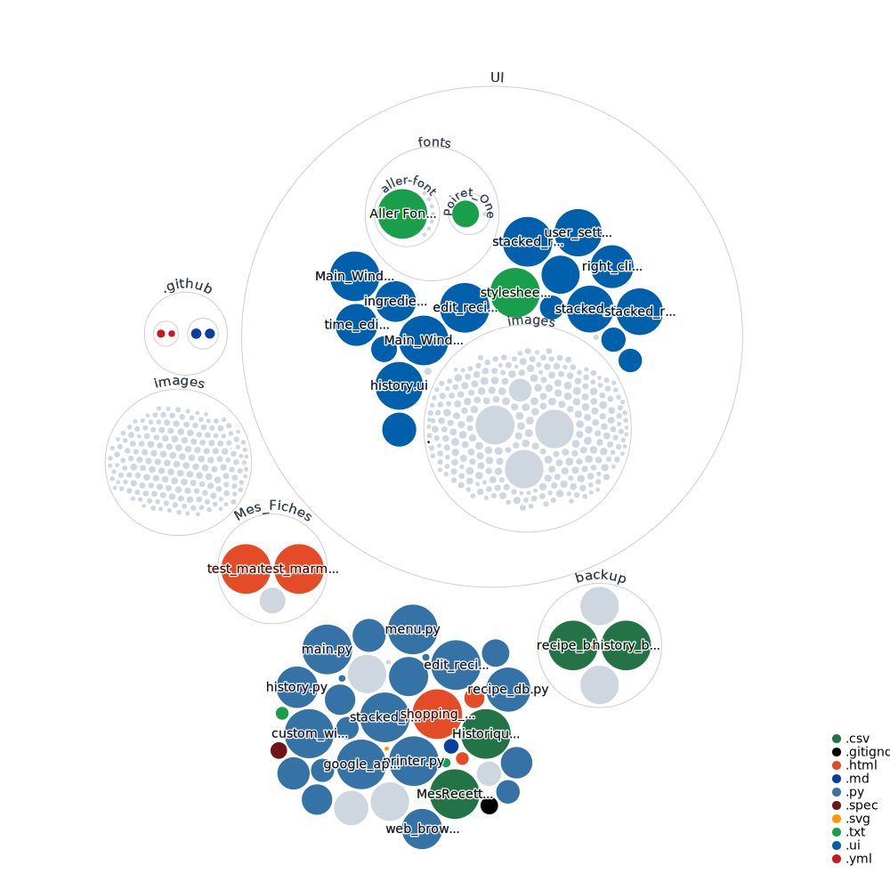

#  À Table !

App to create, organize and plan your own recipes

## Prerequesites
* Python 3.8.5 or higher
* Qt 5.12.8 or higher

### Python dependencies
- [ ] list all additional python libraries

## Contributing
https://github.com/gitextensions/gitextensions/wiki/How-To:-run-Git-Extensions-on-Linux

## Installation
* Clone the entire repository to any local folder
* Launch main.py

## Repository visualization
